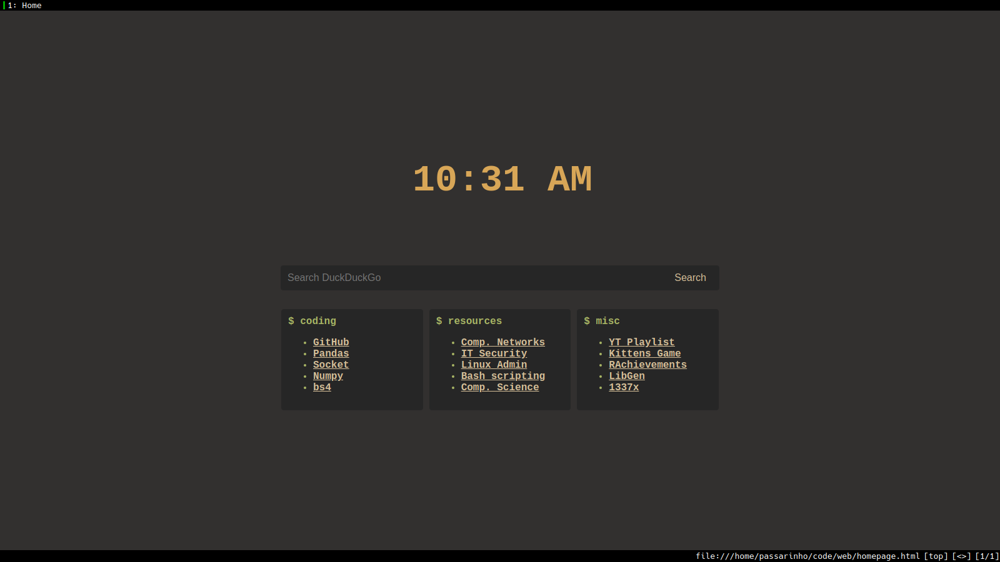
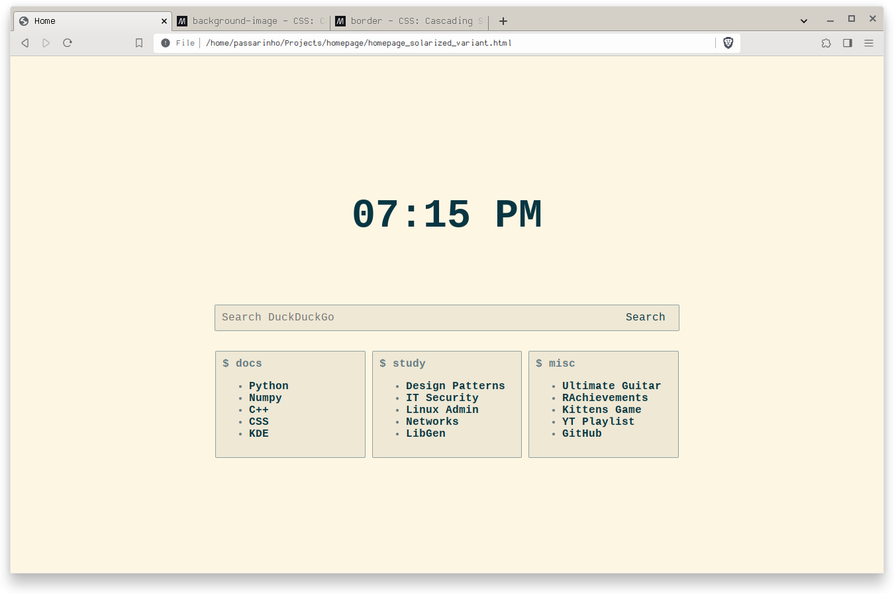
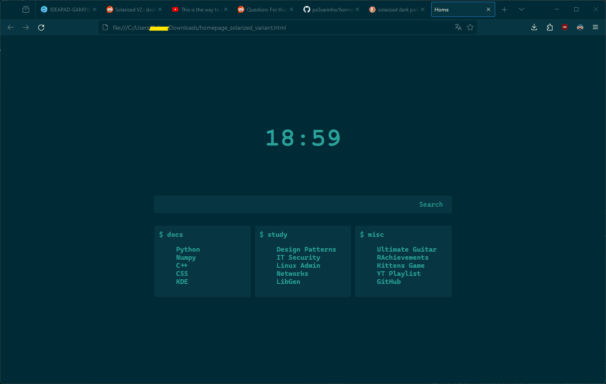
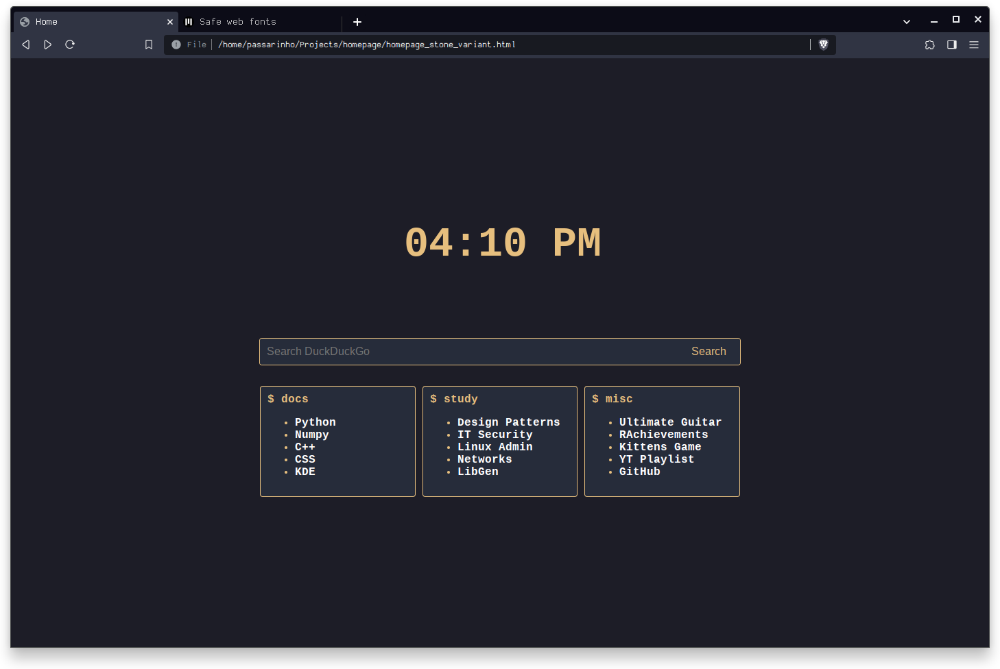
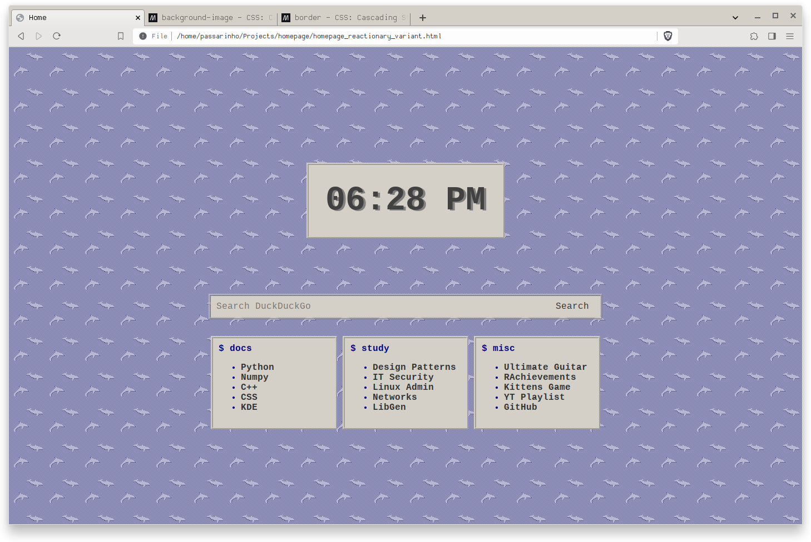

# Homepage
A minimalist browser startpage with a clock, search bar and 3 bookmark categories. It used to be just a gruvbox startpage, but now it has 3 more themes, each based on a different plasma configuration I had/have.

## Gruvbox

## Solarized Light

## Solarized Dark

This one uses Microsoft's cascadia code font.

## Stone

## Reactionary (Windows 9X)

